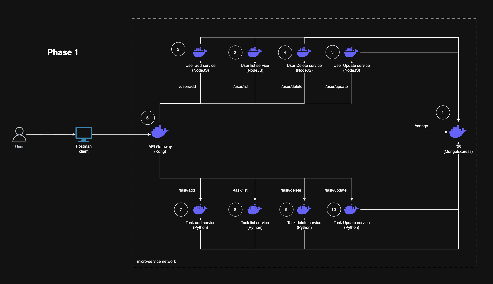

# Micro Service POC
Here I implement a micro-service architecture to practice all the relevant concepts. Implementation is done in phases. Each phase is made as a branch/tag in the repository and `main` branch contains the latest.

# Index
1. [Phase 1](https://github.com/Utshab500/micro-service-poc/tree/phase-1) - Basic micro-service implementation

# Phase 1
In this phase, I only implement a simple CRUD operation breaking each operation in micro-service.

## Architecture


## How to run the stack?

### Pre-req
Required softwares needed before running the stack
1. git
2. docker
3. docker-compose

### Steps
1. Clone the repository.
2. Change directory and get inside the repository.
    ```bash
    cd micro-service-poc
    ```
3. Make sure <b>docker-desktop</b> or <b>docker daemon</b> is running. Execute below command.
    ```bash
    docker compose up -d
    ```
4. Access each service using following <i>Service URLs</i>.

## Mongo Express credentials
| Credentials | Value |
| - | - |
| Username | admin |
| Password | pass |

## Service URLs
<b>Swagger</b> is available for each service, also <b>Postman clinet</b> can be used 
| Service | URL | Swagger URL |
| - | - | - |
| Mongo Express | http://localhost:8081 | |
| User Add | http://localhost:3001 | http://localhost:3001/api-docs |
| User List | http://localhost:3002 | http://localhost:3002/api-docs |
| User Delete | http://localhost:3003 | http://localhost:3003/api-docs |

## How to destroy the stack?

### Linux or MacOS or Windows Subsystem Linux
Execute below script and follow the instructions and put `y` when asked.
```bash
./hard-cleanup.sh
```

### Windows
Execute below commands and follow the instructions and put `y` when asked.
```bash
docker compose down
docker image prune -a
docker network prune
docker volume prune -a
```